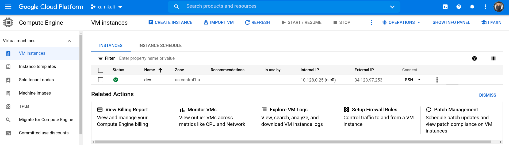
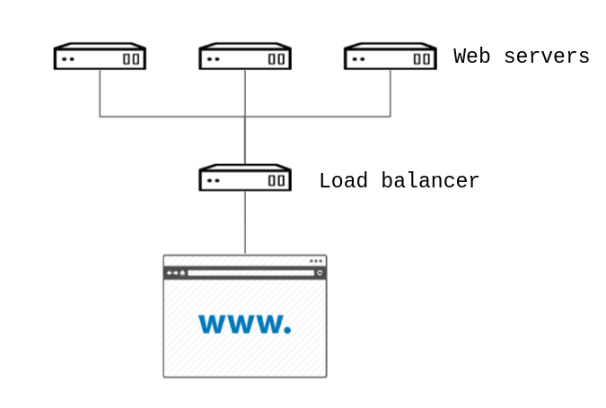
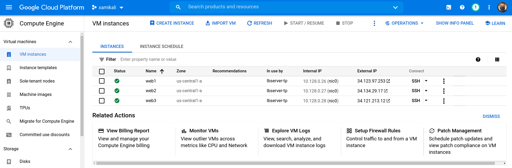
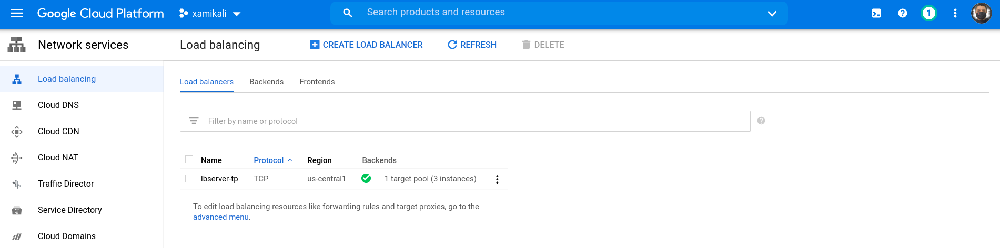

= Automation 101: The Guide
Alex Callejas <rootzilopochtli@gmail.com>
:description: Step-by-step guide to setting up the automation test environment with Google Cloud Platform, from Automation 101 talk.
:sectanchors:
:hide-uri-scheme:
:url-repo: https://github.com/rootzilopochtli/automation-101

== Index
* <<Virtual Machine Installation>>
** <<Download Image>>
** <<Preparation of VM>>
** <<Install the VM>>
** <<Setting up the VM>>
* <<Create Test Environment>>
** <<Create User and grant privileges>>
* <<Ansible + Google>>
** <<Install requisites>>
** <<Credentials>>
** <<Test GCP Ansible modules>>
* <<Create a Load-Balanced Web Service>>
** <<Configuring GCE Credentials in Ansible Playbooks>>
** <<Create GCE Instances>>

== Virtual Machine Installation

The installation of the test environment is performed on a link:https://docs.fedoraproject.org/en-US/quick-docs/getting-started-with-virtualization/[KVM-based virtual machine].

=== Download Image

Useful sites for downloading qcow2 images:

* link:https://alt.fedoraproject.org/cloud/[Fedora Cloud. Cloud Base Images]
* link:https://docs.openstack.org/image-guide/obtain-images.html[OpenStack: Get images]
* link:https://access.redhat.com/downloads/content/479/ver=/rhel---8/8.4/x86_64/product-software[Red Hat Customer Portal: Download]

For this case, we use the image obtained from the link:https://access.redhat.com/[Red Hat Customer Portal], using the account created in link:https://developers.redhat.com/[Red Hat Developers].

=== Preparation of VM

* Setting the qcow2 image

[subs="+quotes"]
----
$ *virt-customize -a _vmlab01.qcow2_ \* <1>
> *--hostname _vmlab01.rootzilopochtli.lab_ \* <2>
> *--root-password password:__rootpw__ \* <3>
> *--ssh-inject 'root:file:__labkey.pub__' \* <4>
> *--uninstall cloud-init \* <5>
> *--selinux-relabel* <6>
[   0.0] Examining the guest ...
[   8.4] Setting a random seed
[   8.5] Setting the machine ID in /etc/machine-id
[   8.5] Setting the hostname: vmlab01.rootzilopochtli.lab
[   8.5] SSH key inject: root
[   9.4] Uninstalling packages: cloud-init
[  11.3] Setting passwords
[  12.0] SELinux relabelling
[  22.1] Finishing off
----
<1> Add disk image file
<2> Set hostname
<3> Set root password
<4> Add ssh public key to the specified user
<5> Uninstall useless initialization software
<6> Due to the modification of several files, SELinux needs to be relabeled

=== Install the VM

* Move the image disk to `/var/lib/libvirt/images`:

[subs="+quotes"]
----
$ *sudo mv vmlab01.qcow2 /var/lib/libvirt/images/*
----

* Install the VM with the image disk (VM is _imported_):

[subs="+quotes"]
----
$ *sudo virt-install --name _vmlab01_ \* <1>
> *--memory _1024_ --vcpus _1_ \* <2>
> *--disk _/var/lib/libvirt/images/vmlab01.qcow2_ --import \* <3>
> *--os-type linux --os-variant rhel8.4 \* <4>
> *--noautoconsole* <5>

Starting install...
Domain creation completed.
----
<1> Set the VM name
<2> Setting up resources for the VM
<3> Import disk image as VM disk
<4> Set OS type and variant
<5> VM console is not required to be sent as output

=== Setting up the VM

* Discover the VM's IP:

[subs="+quotes"]
----
$ *sudo virsh domifaddr vmlab01*
Name       MAC address          Protocol     Address
-------------------------------------------------------------------------------
vnet1      _52:54:00:69:aa:90_    ipv4         *192.168.122.__227__*/24
----

* Access the VM with ssh key:

[subs="+quotes"]
----
$ *ssh -i _labkey_ root@192.168.122.227*
----

* Subscribe the VM

As we use the RHEL image, we have to subscribe it with our link:https://developers.redhat.com/[Red Hat Developers] login account to get packages and updates:

[subs="+quotes"]
----
[root@vmlab01 ~]# *subscription-manager register*
Registering to: subscription.rhsm.redhat.com:443/subscription
Username: *__<Red Hat Developers Account>__*
Password: *__<Red Hat Developers Account Password>__*
The system has been registered with ID: _22b97e3b-b309-4c2e-9d71-04fc31084c1a_
The registered system name is: _vmlab01.rootzilopochtli.lab_
----

* Find and attach the subscription:

[subs="+quotes"]
----
[root@vmlab01 ~]# *subscription-manager list --available* <1>
+-------------------------------------------+
    Available Subscriptions
+-------------------------------------------+
Subscription Name:   Red Hat Developer Subscription for Individuals
Provides:            dotNET on RHEL Beta (for RHEL Server)
                     Red Hat CodeReady Linux Builder for x86_64
                     Red Hat Enterprise Linux for SAP HANA for x86_64
                     Red Hat Ansible Engine
_...output omitted..._
Contract:
Pool ID:             *_8a85f9a076fc4a87017720f2b38a7277_* <2>
Provides Management: No
Available:           12
Suggested:           1
Service Type:
Roles:               Red Hat Enterprise Linux Server
Service Level:       Self-Support
Usage:
Add-ons:
Subscription Type:   Standard
Starts:              01/20/2021
Ends:                01/19/2022
Entitlement Type:    Physical

[root@vmlab01 ~]# *subscription-manager attach --pool=__8a85f9a076fc4a87017720f2b38a7277__* <3>
Successfully attached a subscription for: Red Hat Developer Subscription for Individuals
[root@vmlab01 ~]# *subscription-manager role --set='Red Hat Enterprise Linux Server'* <4>
role set to "Red Hat Enterprise Linux Server".
----
<1> Get the list of available subscriptions
<2> Pool ID
<3> Attach the subscription
<4> Set VM role

===== {nbsp}

* Adding Ansible repo:

[subs="+quotes"]
----
[root@vmlab01 ~]# *subscription-manager repos --list | grep ansible*
Repo ID:   ansible-2.8-for-rhel-8-x86_64-debug-rpms
Repo URL:  https://cdn.redhat.com/content/dist/layered/rhel8/x86_64/ansible/2.8/debug
Repo ID:   ansible-2.8-for-rhel-8-x86_64-source-rpms
Repo URL:  https://cdn.redhat.com/content/dist/layered/rhel8/x86_64/ansible/2.8/source/SRPMS
Repo ID:   *ansible-2.9-for-rhel-8-x86_64-rpms*
Repo URL:  https://cdn.redhat.com/content/dist/layered/rhel8/x86_64/ansible/2.9/os
_...output omitted..._
[root@vmlab01 ~]# *subscription-manager repos --enable ansible-2.9-for-rhel-8-x86_64-rpms*
Repository 'ansible-2.9-for-rhel-8-x86_64-rpms' is enabled for this system.
----

* Installing Ansible:

[subs="+quotes"]
----
[root@vmlab01 ~]# *dnf -y install ansible*
Updating Subscription Management repositories.
Red Hat Enterprise Linux 8 for x86_64 - BaseOS (RPMs)           6.9 MB/s |  33 MB  00:04
Red Hat Ansible Engine 2.9 for RHEL 8 x86_64 (RPMs)             1.2 MB/s | 1.6 MB  00:01
Red Hat Enterprise Linux 8 for x86_64 - AppStream (RPMs)        7.5 MB/s |  30 MB  00:03
_...output omitted..._
  Verifying        : sshpass-1.06-3.el8ae.x86_64                                     1/3
  Verifying        : ansible-2.9.22-1.el8ae.noarch                                   2/3
  Verifying        : python3-jmespath-0.9.0-11.el8.noarch                            3/3
Installed products updated.

Installed:
  ansible-2.9.22-1.el8ae.noarch
  python3-jmespath-0.9.0-11.el8.noarch
  sshpass-1.06-3.el8ae.x86_64

Complete!
----

* Update VM OS:

[subs="+quotes"]
----
[root@vmlab01 ~]# *dnf clean all*
_...output omitted..._
[root@vmlab01 ~]# *dnf update*
_...output omitted..._
----

* Reboot VM:

[subs="+quotes"]
----
[root@vmlab01 ~]# *reboot*
----

== Create Test Environment

=== Create User and grant privileges

* Create `student` user with supplementary `wheel` group:

[subs="+quotes"]
----
[root@vmlab01 ~]# *useradd student -G wheel*
[root@vmlab01 ~]# passwd student
Changing password for user student.
New password: *_student_*
BAD PASSWORD: The password is shorter than 8 characters
Retype new password: *_student_*
passwd: all authentication tokens updated successfully.
----

[NOTE]
====
This allows the user to execute any command with `sudo` and its password.
If no password is to be used with `sudo`, it is necessary to enable it in `/etc/sudoers`, commenting out and uncommenting the corresponding lines, as follows:

`%wheel        ALL=(ALL)       NOPASSWD: ALL`
====

* Add ssh key to `student` user:

[subs="+quotes"]
----
$ *ssh-copy-id -i labkey.pub student@192.168.122.227*
----

* Log in to the VM and test the configuration:

[subs="+quotes"]
----
$ *ssh -i labkey student@192.168.122.227*

Last login: Fri Jun  4 17:34:21 2021 from 192.168.122.1
[student@vmlab01 ~]$ *sudo -l*
Matching Defaults entries for student on vmlab01:
    !visiblepw, always_set_home, match_group_by_gid, always_query_group_plugin, env_reset, env_keep="COLORS DISPLAY HOSTNAME HISTSIZE KDEDIR LS_COLORS", env_keep+="MAIL
    PS1 PS2 QTDIR USERNAME LANG LC_ADDRESS LC_CTYPE", env_keep+="LC_COLLATE LC_IDENTIFICATION LC_MEASUREMENT LC_MESSAGES", env_keep+="LC_MONETARY LC_NAME LC_NUMERIC
    LC_PAPER LC_TELEPHONE", env_keep+="LC_TIME LC_ALL LANGUAGE LINGUAS _XKB_CHARSET XAUTHORITY", secure_path=/sbin\:/bin\:/usr/sbin\:/usr/bin

User student may run the following commands on vmlab01:
    *(ALL) NOPASSWD: ALL*
----

* Install `pip`

[subs="+quotes"]
----
[student@vmlab01 ~]$ *sudo dnf install python3-pip*
----

== Ansible + Google

Ansible contains modules for managing Google Cloud Platform resources, including creating instances, controlling network access, working with persistent disks, managing load balancers, and a lot more.

=== Install requisites

The GCP modules require both the `requests` and the `google-auth` libraries to be installed:

[subs="+quotes"]
----
[student@vmlab01 ~]$ *sudo dnf list python****-requests***
Updating Subscription Management repositories.
Last metadata expiration check: 0:11:09 ago on Fri 04 Jun 2021 05:20:48 PM EDT.
Installed Packages
*python3-requests.noarch*           2.20.0-2.1.el8_1          @System
_...output omitted..._
[student@vmlab01 ~]$ *sudo pip3 install --user student requests google-auth*
Requirement already satisfied: requests in /usr/lib/python3.6/site-packages
Collecting google-auth
_...output omitted..._
Installing collected packages: pyasn1, rsa, cachetools, setuptools, pyasn1-modules, google-auth
Successfully installed cachetools-4.2.2 google-auth-1.30.1 pyasn1-0.4.8 pyasn1-modules-0.2.8 rsa-4.7.2 setuptools-57.0.0
----

* Create a Work directory

In order to store the required files, create a working directory and switch to it:

[subs="+quotes"]
----
[student@vmlab01 ~]$ *mkdir workdir && cd workdir*
----

=== Credentials

To work with the GCP modules, get some credentials in the JSON format:

1. link:https://developers.google.com/identity/protocols/OAuth2ServiceAccount#creatinganaccount[Create a Service Account]
2. link:https://support.google.com/cloud/answer/6158849?hl=en&ref_topic=6262490#serviceaccounts[Download JSON credentials]

=== Test GCP Ansible modules

* Install `git`:

[subs="+quotes"]
----
[student@vmlab01 ~]$ *sudo dnf install git*
----

* Clone `ansible-gce-apache-lb` repo:

[subs="+quotes"]
----
[student@vmlab01 workdir]$ *git clone https://github.com/AlexCallejas/ansible-gce-apache-lb.git*
Cloning into 'ansible-gce-apache-lb'...
remote: Enumerating objects: 22, done.
remote: Total 22 (delta 0), reused 0 (delta 0), pack-reused 22
Unpacking objects: 100% (22/22), 4.50 KiB | 328.00 KiB/s, done.
----

* Create a RSA ssh key

By default, Google Compute Engine (GCE)  adds the ssh-keys of the platform itself; as we need to perform some post-creation tasks, a ssh key is required.

[subs="+quotes"]
----
[student@vmlab01 workdir]$ *ssh-keygen -t rsa -b 4096 -f _gcekey_*
----

* Create a test instance

Switch to `ansible-gce-apache-lb` directory and modify the `gce-test.yml` playbook with your GCE credentials:

[subs="+quotes"]
----
---
- name: Playbook test to create gce instance
  hosts: localhost
  connection: local
  gather_facts: no

  vars:
    service_account_email: _<gce service account email>_ <1>
    credentials_file: _<path to json credentials file>_ <2>
    project_id: _<project id>_ <3>
    machine_type: _n1-standard-1_ <4>
    image: _centos-stream-8_ <5>

  tasks:
    - name: Launch instances
      gce:
        instance_names: *_dev_* <6>
        machine_type: "{{ machine_type }}"
        image: "{{ image }}"
        service_account_email: "{{ service_account_email }}"
        credentials_file: "{{ credentials_file }}"
        project_id: "{{ project_id }}"

----
<1> In the JSON file it is found as `client_email`
<2> For this case: `/home/student/workdir/__<JSON file>__`
<3> In the JSON file it is found as `project_id`
<4> On the link:https://console.cloud.google.com/[GCP console] (menu:Compute Engine[VM Instances > Create an instance]) review available options
<5> On the link:https://console.cloud.google.com/[GCP console] (menu:Compute Engine[VM Instances > Create an instance]) review available options
<6> VM Instance name

Validate in the link:https://console.cloud.google.com/[GCP console] that there is no VM instance created:

[#img-gcp-console]
.Google Cloud Platform Console
image::images/gcp-console.png[align="center"]

Run the `gce-test.yml` playbook:

[subs="+quotes,+macros"]
----
[student@vmlab01 ansible-gce-apache-lb]$ *ansible-playbook gce-test.yml*

PLAY [Playbook test to create gce instance] +++********************************************************+++

TASK [Launch instances] +++****************************************************************************+++
changed: [localhost]

PLAY RECAP +++*****************************************************************************************+++
localhost  : ok=1    *changed=1*    unreachable=0    failed=0    skipped=0    rescued=0    ignored=0

----

Confirm the creation of the VM instance in the link:https://console.cloud.google.com/[GCP console] (menu:Compute Engine[VM Instances]).

[#img-test-vm-instance]
.VM Instances

Click the btn:[VM Instance] name and then click btn:[DELETE] to delete the instance.

== Create a Load-Balanced Web Service

[#img-load-balanced-web-service]
.Load-Balanced Web Service

=== Configuring GCE Credentials in Ansible Playbooks

Modify the `ansible-gce-apache-lb` playbooks with your GCE credentials:

[subs="+quotes"]
----
_...output omitted..._
vars:
  service_account_email: _<gce service account email>_ <1>
  credentials_file: _<path to json credentials file>_ <2>
  project_id: _<project id>_ <3>
_...output omitted..._
----
<1> In the JSON file it is found as `client_email`
<2> For this case: `/home/student/workdir/__<JSON file>__`
<3> In the JSON file it is found as `project_id`

=== Create GCE Instances

* Add the RSA ssh key to `gce-apache.yml` playbook

[subs="+quotes"]
----
_...output omitted..._
- name: Create instances based on image {{ image }}
  gce:
    instance_names: "{{ instance_names }}"
    machine_type: "{{ machine_type }}"
    image: "{{ image }}"
    state: present
    preemptible: true
    tags: http-server
    service_account_email: "{{ service_account_email }}"
    credentials_file: "{{ credentials_file }}"
    project_id: "{{ project_id }}"
    metadata: '{"sshKeys":"*_<gce_user:ssh_pubkey>_*"}' <1>
  register: gce
_...output omitted..._
----
<1> The format of the metadata should be something like: `student:ssh-rsa AAAAB3NzaC1yc2EAAAADAQABAAACAQCc3JcGt+BAunQPmm04gCQbF5x9po ..."}'`

[NOTE]
====
To configure the user of the instances in the GCE console, follow the note at link:https://cloud.google.com/compute/docs/instances/managing-instance-access#enable_oslogin[Managing access to VM Instances → Setting up OS Login] from Compute Engine Documentation.
====

* Run the `gce-lb-apache.yml` with the RSA ssh key file:

[subs="+quotes"]
----
[student@vmlab01 ansible-gce-apache-lb]$ *ansible-playbook gce-lb-apache.yml --key-file /home/student/workdir/gcekey*
----

[WARNING]
====
If this process ends with errors, the instances created must be deleted, to avoid any charges in GCP.

Run the `gce-clean.yml` playbook:

`$ ansible-playbook gce-clean.yml`
====

* Confirms the creation of balanced web instances in GCE:

[#img-gce-web-instances]
.VM Web Instances

* Confirms the creation of load balancer instance in GCE

On the link:https://console.cloud.google.com/[GCP console] (menu:Network services[Load balancing])

[#img-gce-lb-instances]
.Load Balancer Instance

=== Test GCE Load Balanced Web Instances

To validate that the balancing is working correctly run `curl` to the *public IP address* of the _load balancer instance_ and confirm that it responds with the *public IP address* of each _web instance_:

[subs="+quotes"]
----
[student@vmlab01 ansible-gce-apache-lb]$ *curl http://__34.122.219.159__* <1>
<!-- Ansible managed -->
<html>
<head><title>Apache is running!</title></head>
<body>
<h1>
Hello from *_34.123.97.253_* <2>
</h1>
</body>
</html>
[student@vmlab01 ansible-gce-apache-lb]$ *curl http://__34.122.219.159__*
<!-- Ansible managed -->
<html>
<head><title>Apache is running!</title></head>
<body>
<h1>
Hello from *_34.134.29.17_* <3>
</h1>
</body>
</html>
[student@vmlab01 ansible-gce-apache-lb]$ *curl http://__34.122.219.159__*
<!-- Ansible managed -->
<html>
<head><title>Apache is running!</title></head>
<body>
<h1>
Hello from *_34.121.213.12_* <4>
</h1>
</body>
</html>
----
<1> Load balancer public IP address
<2> Web instance `web1` public IP address
<3> Web instance `web2` public IP address
<4> Web instance `web3` public IP address

[WARNING]
====
On completion of testing, remove balanced web instances to avoid GCP charges.

Run the `gce-clean.yml` playbook:

`$ ansible-playbook gce-clean.yml`
====

== {nbsp}

[role="References"]
[NOTE]
====
This guide is based on my article published in the Red Hat TAM Blog: link:https://www.redhat.com/en/blog/creating-load-balanced-web-service-cloud-ansible[Creating a load-balanced web service on cloud with Ansible].

link:https://twitter.com/dark_axl[Alex Callejas] | 2018
====
